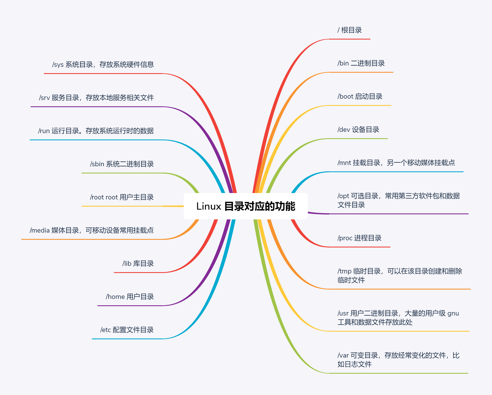
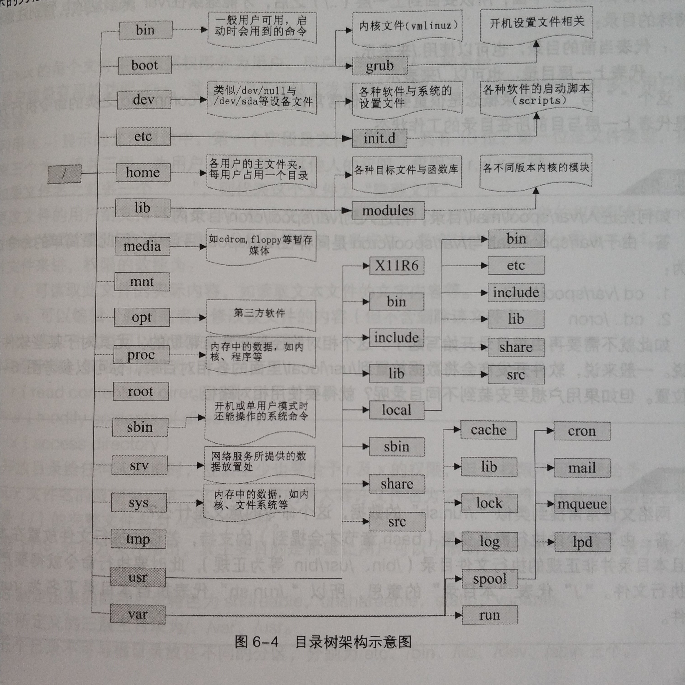

# Linux的文件权限与目录配置

#### linux文件权限

创建文件默认权限：-rw-r-r

目录默认权限：drwx-r-x-r-x

umask指定文件与目录默认权限，默认0022（去掉了w权限）

```
[-][rwx][r-x][r--][1][root][root][238][Jun 18 17:22][test.txt]
 1	2	 3	  4	  5	   6	7	  8	  		9		  10
```

1：`[-]`代表文件，`[d]`代表目录，`[l]`代表链接文件，`[b]`代表设备文件里可供存储的接口设备，`[c]`表示设备文件的串行端口设备，例如键盘、鼠标

2：拥有者权限

3：同用户组用户权限

4：其他用户权限

5：表示有多少文件名连接到此节点

6：表示这个文件或目录的所有者账号

7：表示这个文件的所属用户组

8：表示这个文件的容量大小

9：表示这个文件的创建日期或者最近的修改日期

10：表示文件名

**改变文件属性与权限**

> chgrp：改变文件所属用户组
>
> chown：改变文件所有者
>
> chmod：改变文件权限

- 改变文件所属用户组：chgrp
  - 要被改变的组名必须在`/etc/group`文件内			
- 改变文件所有者：chown
  -  用户必须存在`/etc/passwd`文件中
  - `chown users test.txt`改变了文件所有者，`chown root:root test.txt`改变了所有者与用户组
- 改变权限：chmod
  - 各权限分数：r：4，w：2，x：1，`chmod 750 text.txt`
  - 符号类型改变文件权限：u表示users，g表示group，o表示others，a表示全部，+(加入)，-(减去)，=(设置)，`chmod u=rwx,go=rx test.txt`

设置文件的隐藏属性chattr和lsattr：


**文件种类与扩展名**

普通文件（regular file） 纯文本文件（ASCII）二进制文件（binary）数据格式文件（data）

文件长度限制：

- 单一文件或目录最大容许文件名为255各个字符
- 包含完整路径名称及目录（/）的完整文件名为4096个字符


**mask**

如果 `umask  = 0002 `  ，那么该文件的权限为 `0666 - 0002 = 0664(rw-rw-r)` ，该目录的权限为 `0777-0002 = 0775(rwxrwxr-x)`


Linux目录配置



不可与根目录（/）分开的目录：

- /etc：配置文件
- /bin：重要执行文件
- /dev：所需要的设备文件
- /lib：执行文件所需的函数库与内核所需模块
- /sbin：重要的系统执行文件

**/usr的意义与内容**

- /usr里放置的数据属于可分享与不可变动的
| 目录 | 应放置文件内容 |
| ----| ----|
| /usr/X11R6/ | 为X Window系统重要数据所放置目录，名字意义表示为最后的X版本为第11版，且该版的第6次释出 |
| /usr/bin/ | 绝大部分用户的可用命令都放在这里 |
| /usr/include/ | C/C++等程序语言的头文件与包含文件放置处，当以tarball方式安装某些数据时，会使用到里头的包含文件 |
| /usr/lib/ | 包含各应用软件的函数库、目标文件以及不被一般用户惯用的执行文件或脚本 |
| /usr/local/ | 系统管理员在本机自行安装的软件 |
| /usr/sbin/ | 非系统正常运行所需要的系统命令  |
| /usr/share/ | 放置共享文件的地方，在这个目录下放置的数据几乎是不分硬件架构均可读取的数据，几乎都是文本文件，在此目录下常见的目录：`/usr/share/man`在线帮助文件`/usr/share/doc`软件杂项的文件说明`/usr/share/zoneinfo`与时区有关的时区文件 |
| /usr/src/ | 一般源码放置在这里 |


**/var 的意义与内容**

| 目录 | 应放置文件内容 |
| ------| -------|
| /var/cache/ | 应用程序本身运行过程中会产生的一些暂存文件 |
| /var/lib/ | 程序执行过程本身需要使用到的数据文件目录 |
| /var/lock/ | 某些设备文件或者文件资源一次只能被一个应用程序所使用，如果同时有两个程序同时使用该设备，就可能产生一些错误，因此需要将该设备上锁 |
| /var/log/ |登录文件放置目录 |
| /var/mail/ | 放置个人电子邮件的目录，这个目录也被放置到/var/spool/mail/目录下，这两个目录互为连接文件 |
| /var/run/ | 某些程序或服务启动后，会将它们的PID放置在这个目录下 |
| /var/spool/ | 这个目录通常放置一些队列数据，这些数据通常被使用后就会删除 |



#### 文件特殊权限：SUID,SGID,SBIT

**SetUID**

- 当s这个标志出现在文件所有者x权限上时`-rwsr-xr-x`，此时就被称为Set UID，简称SUID特殊权限。
- SUID权限仅对二进制程序（binary program）有效；
- 执行者对于该程序需要具有x的可执行权限；
- 本权限仅在执行该程序的过程中（run-time）有效；
- 执行者将具有该程序所有者（owner）的权限；

**SGID**

- 与SUID不同，SGID可以针对文件或目录`-rwx--s--x`，对于文件具有以下功能：

  - SGID对二进制程序有用；

  - 程序执行者对于该程序来说，需具备x的权限；

  - 执行者在执行过程中将会获得该程序用户组的支持；
- 当一个目录设置了SGID的权限后，具有如下功能：
  - 用户对于此目录具有r与x的权限时，该用户能够进入此目录；
  - 用户在此目录下的有效用户组（effective group）将会变成该目录的用户组；
  - 若用户在此目录下具有w的权限，则用户所创建的新文件的用户组与此目录的用户组相同；

**Sticky Bit**

- Sticky Bit（SBIT）目前只针对目录有效`-drwxrwxrwt`，对目录具有的作用是：
  - 当用户对于此目录具有w，x权限，既具有写入的权限时；
  - 当用户在该目录下创建文件或目录时，仅有自己与root才有权利删除该文件；
    - 比如：当甲用户于A目录是具有用户组或其他人身份，并且拥有该目录w的权限，这表示甲用户对该目录内任何人新建的目录或文件均可进行删除、重命名、移动等操作。不过，如果将A目录加上了SBIT的权限项目时，则甲只能够针对自己创建的文件或目录进行删除、重命名、移动等操作，而无法删除他人的文件。
- **SUID/SGID/SBIT权限设置**

4：SUID，2：SGID，1：SBIT

S，T表示空，用户本身都不具有执行或写权限

`chmod 4755 test`：4表示特殊权限

`chmod u=rwxs，g=xs，o=xt`

#### 权限与命令间的关系

- 让用户能进入某目录成为“可工作目录”的基本权限：
  - 可使用的命令：例如cd等切换工作目录的命令
  - 目录所需权限：用户对这个目录至少需要具有**x**的权限
  - 额外需求：如果用户想要在这个目录内利用ls查阅文件名，则用户对此目录还需要**r**的权限
- 用户在某个目录内读取一个文件基本权限：
  - 可使用的命令：例如cat，more，less等
  - 目录所需权限：用户对这个目录至少需要具有**x**权限
  - 文件所需权限：用户对文件至少需要具有**r**的权限
- 让用户可以修改一个文件的基本权限：
  - 可以使用的命令：nano，vi命令等
  - 目录所需权限：用户在该文件所在的目录至少需要有**x**权限
  - 文件所需权限：用户对该文件至少要有**r**，**w**权限
- 让用户可以创建一个文件的基本权限：
  - 目录所需权限：用户在该目录至少要有**x**的权限
  - 文件所需权限：用户在该文件至少要有**x**的权限