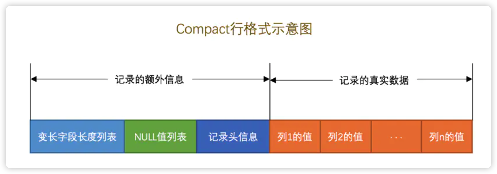
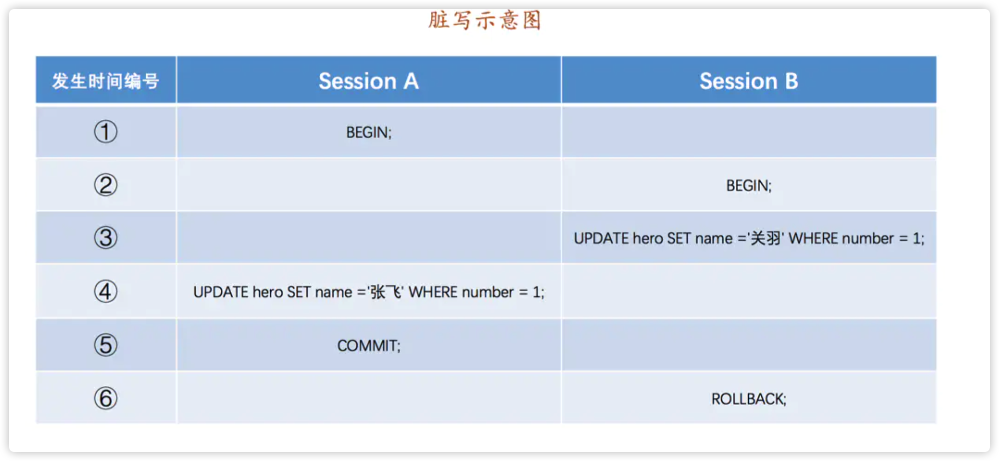
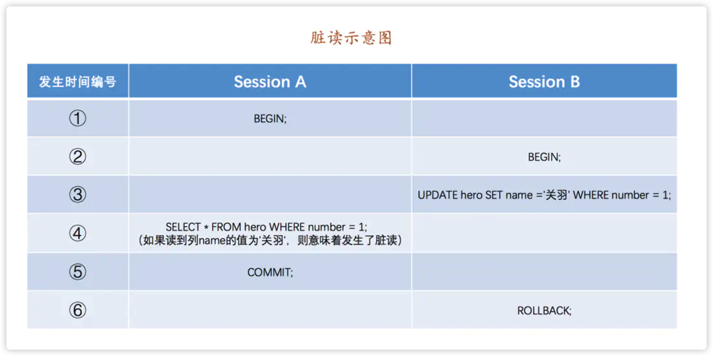
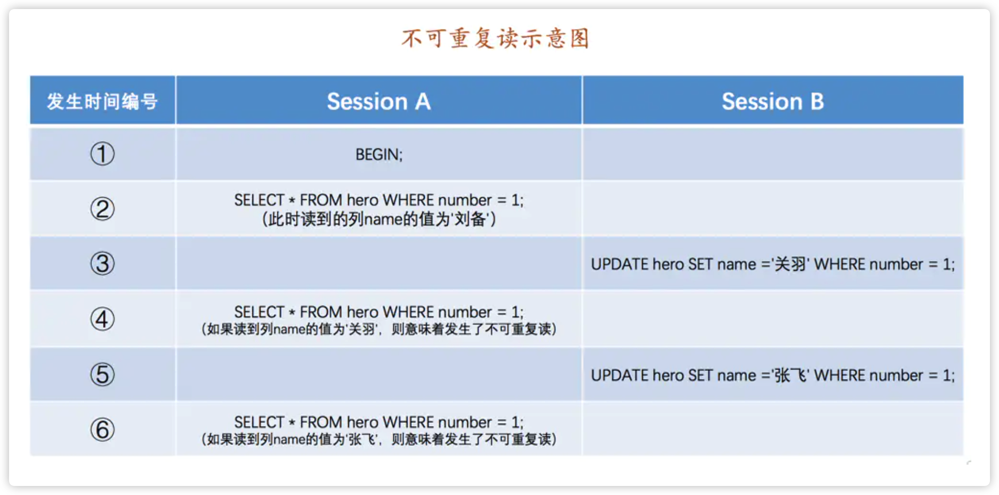
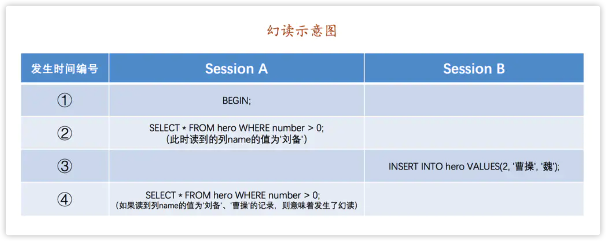

## 字符集和比较规则

1. 字符集指的是某个字符范围的编码规则

2. 比较规则是针对某个字符集中的字符比较大小的一种规则
3. 查看 MySQL 中支持的字符集和比较规则

> show (character set|charset) like 匹配模式
>
> show collation like 匹配模式

4. MySQL 有 4 个级别的字符集和比较规则

- 服务器级别：`character_set_server` 表示服务器级别的字符集，`collation_server` 表示服务器级别的比较规则
- 数据库级别：创建和修改数据库可以指定字符集和比较规则
- 表级别：
- 列级别

## Innodb 存储结构

页是 MySQL 中磁盘和内存交互的基本单位，也是 MySQL 管理存储空间的基本单位。

一个页一般是 16KB，当记录中的数据太多，当前页放不下时，会把多余的数据存储到其它页中，这种现象称为行溢出。

innodb 4 中行格式：

1. Compact 行格式，

   

   

2. Redundant

3. Dynamic

4. Compressed

## B+树索引

### 回表的代价

访问二级索引使用**顺序 I/O**，访问聚簇索引使用 **随机 I/O**

<font color="red">从二级索引查出的数据越多则需要的回表的记录越多，使用二级索引的性能就越低。</font>

一般可以使用限制查询获取较少的记录会让优化器选择使用**二级索引+回表**

### 覆盖索引

为了避免回表操作的性能损耗，<font color="red">最好在查询列表里只包含索引列</font>

### 如何挑选索引

#### 考虑列的基数

如某个列包含 `2,5,8,2,5,8,2,5,8`，虽然有 9 条记录，但该列的基数却是 3。

<font color="red">在记录行数一定的情况下，列的基数越大，该列中的值越分散，列的基数越小，该列中的值越集中。</font>如果所有记录在该列中的值都一样，那为该列建立索引是没有用的，因为所有值都一样就无法排序，无法进行快速查找，而且如果某个建立了二级索引列的重复值特别多，那么使用这个二级索引查出的记录还可能要做回表操作，这样性能损耗更大。所以<font color="red">最好为那些列的基数大的列建立索引，基数太小的列建立索引效果不太好。</font>

#### 索引列的类型尽量小

如在对某个整数列建立索引时，**在表示整数范围允许的情况下，尽量让索引列使用较小的类型**，因为：

- 数据类型越小，在查询时进行的比较操作越快
- 数据类型越小，索引占用的存储空间越少，在一个数据页就可以放下更多的记录，从而减少磁盘 I/O 带来的性能损耗，意味着可以把更多的数据页缓存在内存中，从而加快读写效率。

#### 索引字符串值的前缀

只对字符串的前几个字符进行索引，在查找记录时虽然不能准确定位到记录的位置，但能定位到相应前缀所在的位置，然后根据前缀相同的记录的主键值回表查询完整的字符串值。

**副作用**：因为使用了索引列前缀，在 `select * from person_info order by name limit 10;`，因为二级索引中不包含完整的 name 列信息，所以无法对前十个字符相同，后边的字符不同的记录进行排序。**索引列前缀无法支持使用索引排序，只能使用文件排序。**

#### 让索引列在比较表达式中单独出现

如：

```mysql
where my_col * 2 < 4 # bad
where my_col < 4/2   # good
```

**如果索引列在比较表达式中不是以单独列的形式出现，而是以某个表达式或者函数调用形式出现，是用不到索引的。**

#### 顺序插入主键

因为<font color="red">数据页和记录时必须按照记录主键值从小到大顺序进行排序</font>，如果插入的主键值忽大忽小，在数据页满了的情况下，会造成页分裂和记录移位。

#### 避免冗余和重复索引

## 数据库与文件系统

`InnoDB` 和 `MyISAM` 都在数据目录下对应的数据库子目录下创建了一个专门用于描述表结构的文件：`表名.frm`

### InnoDB 如何存储表数据

- InnoDB 使用页为基本单位来管理存储空间，默认页大小为 16KB
- InnoDB 每个索引都对应着一棵 B+ 树，该 B+树每个节点都是一个数据页，数据页之间不必要是物理连续，因为数据页之间有双向链表来维护着这些页的顺序。
- InnoDB 聚簇索引的叶子节点存储了完整的用户记录。

为了管理这些页，InnoDB 采用了表空间或文件空间的概念，它可以对应文件系统上一个或多个真实文件，每个表空间可以被划分为很多个页。

#### 系统表空间

InnoDB 会在数据目录下创建一个名为 `ibdata1` ，大小为 12M 的文件。该文件为自扩展文件。可以通过参数修改配置

```
[server]
innodb_data_file_path=data1:512M;data2:512M;autoextend
```

#### 独立表空间

InnoDB 会为每个表建立一个独立表空间，使用独立表空间来存储数据，会在该表所属数据库对应的子目录下创建一个表示该独立表空间的文件，文件和表明空间相同，所以一个与数据库对应的目录下会有：

```
.frm # 表结构
.ibd # 表空间
```

为了更好的管理表空间中的页，提出了区概念，对于 16KB 的页，连续 64 个页就是一个区，换言之一个区默认占用 1MB 空间，256 区被划分为一组。

#### MyISAM 存储表数据

```
.frm # 表结构
.MYD # 数据文件
.MYI # 索引文件
```

## 查询

### 访问方法

#### const

`const` 只能在主键列或者唯一二级索引列和一个常数进行等值比较时才有效，如果主键或者唯一二级索引是由多个列构成，索引中的每一个列都需要与常数进行等值比较才有效。对于唯一二级索引，查询 null 值的情况比较特殊，`select * from table where key2 is null` ，因为唯一二级索引列并不限制 null 值的数量，所以该语句不可以使用 `const` 访问方法。

#### ref

`ref` 由于普通二级索引不限制索引列值的唯一性，所以可能找到多条对应的记录，换言之使用二级索引来执行查询的代价取决于等值匹配到的二级索引记录条数。如果匹配的记录较少，则回表的代价还是比较低的，所以 MySQL 可能选择使用索引而不是全表扫描的方式来执行查询，这种搜索条件为二级索引列与常数等值比较的访问方法称为：`ref`

#### ref_or_null

当不仅想找出某个二级索引列的值等于某个常数的记录，还想把该列的值为 null 的记录也找出来

```mysql
select * from single_table where key1 = 'abc' or key1 is null;
```

当使用二级索引而不是全表扫描的方式执行该查询时，这种类型的查询方法就称为 `ref_or_null`。

#### range

当搜索条件不只是要求索引列与常数的等值匹配，而是索引列需要匹配某个或某些范围的值，这种利用范围进行匹配的访问方法称为：`range`

```mysql
select * from single_table where key2 in (1438,6328) or (key2 >= 38 and key2 <= 79);
```

- key2 = 1438
- key2 = 6328
- key2 ∈ [38,79]

前两个索引列等值匹配的情况称之为单点区间，最后一个称为连续范围区间。

#### index

前置条件：key_part1 - key_part3 被设置成了联合索引 `idx_key_part`

```mysql
select key_part1,key_part2,key_part3 from single_table where key_part2 = 'abc';
```

该查询符合条件：

- 查询列表只有 3 个列，索引` idx_key_part` 包含了这 3 列
- 搜索条件只有 key_part2 列，该列也包含在索引 `idx_key_part` 中

如此则可以直接遍历`idx_key_part` 索引的叶子节点记录来比较 `key_part2 = 'abc'`，因为二级索引记录比聚簇索引记录小的多（聚簇索引记录存储所有用户定义的列以及隐藏列，而二级索引记录只需要存放索引列和主键），且这个过程也不用进行回表操作，所以直接遍历二级索引比直接遍历聚簇索引的成本要小很多，这种采用遍历二级索引记录的执行方式称为：`index`。

#### all

全表扫描执行查询的方式称之为：`all`。

#### eq_ref

在连接查询中对被驱动表使用主键值或者唯一二级索引列的值进行等值查找的查询执行方式为：`eq_ref`


### 索引合并

MySQL 在一般情况下执行一个查询最多只会用到单个二级索引，在特殊情况下也可能在一个查询中使用到多个二级索引，这种使用到多个索引来完成一次的查询执行方法称为：`index merge`

#### intersection 交集

```mysql
select * from single_table where key1 = 'a' and key3 = 'b';
```

取交集的方式为：

- 从 key1 二级索引对应的 B+ 树取出 `key1 = 'a'` 的相关记录
- 从 key3 二级索引对应的 B+ 树取出 `key3 = 'b'`的相关记录
- 二级索引的记录都是由**索引列+主键**构成，所以可以计算出这两个结果集中 `id` 值的交集。
- 从上一步生成的 `id` 值列表进行回表操作，从聚簇索引中把指定 id 值的完整用户记录取出，返回给用户。

MySQL 在某些特定的情况下才可能使用到 intersection 索引合并：

- 二级索引列是等值匹配，对于联合索引，在联合索引中的每个列都必须等值匹配，不能出现只匹配部分列的情况。
- 主键列可以使范围匹配。

优化器只有在单独根据搜索条件从某个二级索引中获取的记录数太多，导致回表开销太大，而通过 intersection 索引合并后需要回表的记录数大大减少时才会使用 intersection 索引合并。

#### union 并集

并集适用于使用不同索引的搜索条件之间使用 OR 连接起来的情况，MySQL 在某些特定条件情况下才会用到 Union：

- 二级索引列是等值匹配，联合索引每个列都必须是等值匹配，不能出现只匹配部分列的情况。
- 主键列可以使范围匹配

优化器只有在单独根据搜索条件从某个二级索引中获取的记录数比较少，通过 union 索引合并后进行访问的代价比全表扫描更小时才会使用 union 索引合并。

#### sort-union

根据指定条件从二级索引中获取记录，并按照记录的主键值进行排序，之后按照 union 索引合并方式执行的称为 sort-union。

## explain 各字段含义

### id

<font color="red">查询语句中每出现一个 `select` 关键字，MySQL 就会为它分配一个唯一的 id 值。</font>对于连接查询，一个 `select` 关键字后边的 from 子句可以跟随多个表，所以在连接查询执行计划中，<font color="red">每个表都会对应一条记录，但是这些记录的 id 值都是相同的，出现在前边的表示驱动表，后边的表是被驱动表。</font>

### select_type

MySQL 为每一个 `select` 关键字代表的小查询都定义了一个 select_type 属性

#### simple

查询语句不包含 `union` 或者子查询的查询都算作 `simple` 类型

#### primary

对于包含 `union，union all` 或者子查询的大查询来说，它是由几个小查询组成的，其中最左边的查询 `select_type` 值就是 `primary`

#### union

对于包含 `union` 或者 `union all` 大查询来说，它是由几个小查询组成的，其中除了最左边的那个小查询外，其余的小查询的 `select_type` 值就是 `union` 

#### union result

MySQL 选择使用临时表来完成 union 查询的去重工作，对该临时表的查询就是 `select_type` 是 `union result` 

#### subquery

如果包含的子查询语句不能够转为对应的 `semi-join` 形式，并且该子查询不是相关子查询，并且查询优化器决定采用将该子查询物化的方案来执行该子查询，该子查询的第一个 `select_type` 就是 `subquery`。由于 `select_type` 为 `subquery` 的子查询会被物化，所以只需要执行一遍。

#### dependent subquery

包含子查询的查询语句不能转为对应的 `semi-join` ，并且该子查询是相关子查询，则该子查询的第一个 `select`表示的就是 `dependent subquery`。`select_type`为 dependent subquery 的查询可能会被执行多次。

#### dependent union

在包含 union 或者 union all 的大查询中，如果各个小查询都依赖于外层查询，除了最左边的小查询之外，其余的小查询 select_type 的值就是 dependent union。

#### derived

采用物化的方式执行的包含派生表的查询，该派生表对应的子查询的 select_type 就是 derived。

#### materialized

当查询优化器在执行包含子查询的语句时，选择将子查询物化之后与外层查询进行连接查询时，该子查询对应的 `select_type` 属性就是 `materialized`

#### uncacheable subquery

#### uncacheable union

### partitions

### type

访问方法

### possible_keys 和 key

possible_keys 表示某个查询语句中， 对某个表执行单表查询是可能用到的索引有哪些

key 表示实际用到的索引有哪些

**possible_key 列中的值不是越多越好，可能使用索引越多，查询优化器计算查询成本时就得花费更长的时间，如果可以，应该尽量删除那些用不到的索引。**

### key_len

表示当优化器决定使用某个索引执行查询时，该索引记录的最大长度。

### ref

当使用索引列等值匹配的条件去执行查询时，ref 列展示与索引列作等值匹配的值是什么，如是一个常数或者某个列。

### rows

代表预计需要扫描的行数

#### filtered

MySQL 在计算驱动表扇出时采用的一个策略：

- 如果使用的是全表扫描的方式执行单表查询，那么计算驱动表扇出时需要估计出满足搜索条件的记录到底有多少条
- 如果使用的是索引执行的单表扫描，那么计算驱动表扇出的时候需要估计出满足除使用到对应索引的搜索条件外的其他搜索条件的记录有多少条。


## 事务

**脏写：**<font color="red">一个事务修改了另一个未提交事务修改过的数据，就意味着发生了脏写。</font>



**脏读：**<font color="red">一个事务读到了另一个未提交事务修改过的数据，意味着发生了脏读。</font>



**不可重复读：**<font color="red">一个事务只能读到另一个已经提交的事务修改过的数据，并且其他事务每对该数据进行一次修改并提交后，该事务都能查询得到最新值，意味着发生不可重复读。</font>



**幻读：**<font color="red">一个事务先根据某些条件查询出一些记录，之后另一个事务又向表中插入了符合这些条件的记录，原先的事务再次按照该条件查询时，能把另一个事务插入的记录也读出来，意味着发生了幻读。</font>



### SQL 标准的四种隔离级别：

|           隔离级别           | 脏读 | 不可重复读 | 幻读 |
| :--------------------------: | :--: | :--------: | :--: |
| read uncommitted（未提交读） |  √   |     √      |  √   |
|  read committed （提交读）   |  ×   |     √      |  √   |
| repeatable read （可重复读） |  x   |     x      |  √   |
|    serializable（串行化）    |  x   |     x      |  x   |

## 锁

### 一致性读（Consistent Reads）

事务利用 mvcc 进行读取的操作称为一致性读。所有的普通 select 语句在 `Read committed、repeatable read` 隔离级别下都算是一致性读。

一致性读并不会对表中的任何记录做加锁操作，其它事务可以自由的对表中的记录做改动。

### 锁定读（Locking Reads）

在读取记录时加 S 锁：

```
select ... lock in share mode;
```

在读取记录时加 X 锁：

```
select ... for update;
```

#### 共享锁（Shared Locks）

在事务要读取一条记录时，需要先获取该记录的 S（shared Locks） 锁。

#### 独占锁（Exclusive Locks）

在事务要改动一条记录时，需要先获取该记录的 X 锁。

#### 意向共享锁（Intention Shared Lock）

当事务准备在某条记录上加 S 锁时，需要现在表级别加一个 IS 锁。

#### 意向独占锁（Intention Exclusive Lock）

当事务准备在某条记录上加 X 锁时，需要先在表级别加一个 IX 锁。

<font color="red">IS、IX 锁是表级锁，它们的提出仅仅为了在之后加表级别的 S 锁和 X 锁时可以快速判断表中的记录是否被上锁，以避免用遍历的方式来查看表中有没有上锁的记录，就是说 IS 和 IX 锁时兼容的，IX 和 IX 锁是兼容的。</font>


