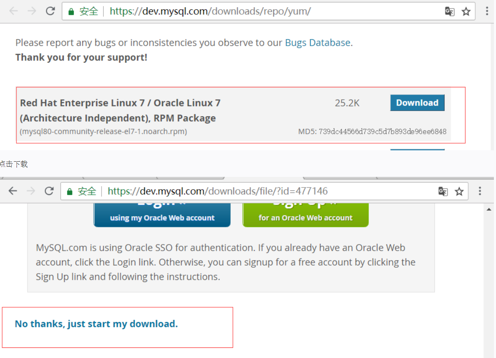

按照 MySQL -> Nginx -> PHP

### MySQL8.0

1. 首先去官网获得下载地址，通过 wget 命令下载



2. 安装 MySQL 源 
    - `yum -y localinstall mysql80-xxxx-xxxx-xxxx(这里安装的是上一步下载下来的MySQL源)`
    - `yum -y install mysql-community-server`
3. 启动 MySQL 服务
    - `systemctl start mysqld`
4. 设置开机自启
    - `systemctl enable mysqld`
    - `systemctl daemon-reload`
5. 修改 root 本地登录密码
    - `grep 'password' /var/log/mysqld.log` 这里会输出一个自动生成的临时密码，再用此密码登录
6. 更改 root 账户密码
    -  `ALTER USER 'root'@'localhost' IDENTIFIED BY 'XXXX'` （MySQL8 默认密码策略必须是大小写数字特殊字符组成，至少 8 位）
7. 创建用户，授权远程登录
    1. `CREATE USER 'zhuzi'@'%' IDENTIFIED BY 'xxxxx'`
    2. `GRANT ALL ON *.* TO 'zhuzi'@'%'`
    3. `ALTER USER 'Zhuzi'@'%' IDENTIFIED BY 'XXXX' PASSWORD EXPIRE NEVER`
    4. `ALTER USER 'Zhuzi'@'%' IDENTIFIED WITH mysql_native_password BY 'XXXXX'`
    5. `FLUSH PRIVILEGES`

### Nginx 安装

1. 首先安装 Nginx 的依赖程序

    - zlib：用于支持 gzip 模块
    - pcre：用于支持 rewrite 模块
    - openssl：用于支持 ssl 功能

    `yum -y install zlib pcre pcre-devel openssl openssl-devel`

2. 创建一个 nginx 运行用户

    - `groupadd -g 112 nginx`
    - `useradd nginx -u 112 -g nginx -s /sbin/nologin -r`

3. Nginx 编译参数

    ```
    ./configure \
    --user=nginx \	# 启动程序所属用户
    --group=nginx \ # 组
    --prefix=/usr/local/lnmp/nginx \ # 按照路径
    --sbin-path=/usr/sbin/nginx \ # nginx 二进制文件的路径名
    --conf-path=/etc/nginx/nginx.conf \ # 配置文件路径
    --error-log-path=/var/log/nginx/error.log \ # 错误日志文件路径
    --http-log-path=/var/log/nginx/access.log \ # 访问日志文件路径
    --http-client-body-temp-path=/tmp/nginx/client_body \ # 设置存储 HTTP 客户端请求主体的临时文件路径
    --http-proxy-temp-path=/tmp/nginx/proxy \ # 设置存储 HTTP 代理临时文件的路径
    --http-fastcgi-temp-path=/tmp/nginx/fastcgi \ # 设置存储 HTTP fastcgi 的临时文件路径
    --pid-path=/var/run/nginx.pid \ # nginx.pid 文件路径
    --lock-path=/var/lock/subsys/nginx \ # nginx.lock 文件路径
    --with-http_stub_status_module \ # 安装可以监控 nginx 状态的模块
    --with-http_ssl_module \ # 启用 SSL 支持
    --with-http_gzip_static_module \ # 启用 gzip 压缩
    --with-pcre \ # 启用正则表达式
    --with-http_realip_module \ # 启用 realip 获取真实 IP
    --with-http_sub_module # 启用替换网站内容的模块
    --with-http_v2_module # 支持  http/2
    make
    make install
    # 安装完成后使用 nginx -V 查看版本和编译参数
    nginx -V
    ```

    4. 控制 nginx 服务的命令
        - 启动：nginx
        - 停止：nginx -s stop
        - 退出：nginx -s quit
        - 重启：nginx -s reopen
        - 重新加载：nginx -s reload
        - 平滑启动：kill -HUP PID （kill -HUP cat /var/run/nginx.pid）

    ##### nginx 追加模块

    1. nginx  -V  查看 nginx 的配置信息
    2. 将 /sbin/nginx 的二进制文件复制备份，此处需要停止 nginx 服务
    3. 切换到以前的源码编译目录，复制 nginx configure 以前的配置，将需要的模块再追加进去，然后 make ，不需要 make install 
    4. make 完成后 将源码 obj 目录下的 nginx 二进制文件复制到 /usr/sbin/ 下
    5. 最后再启动 nginx 即可，若发生 nginx.pid failed，使用 nginx -c /path/nginx.conf 后台运行再 nginx -s reload

    

    ### PHP7

    1. 官网下载 php 源码包
    2. 安装依赖

    `yum install -y libxml2-devel libtool* curl-devel libjpeg-devel libpng-devel freetype-devel libmcrypt libmcrypt-devel`

    如果 libmcrypt 安装报错，可以源码编译安装

    3. 创建 php 的用户和用户组

    4. 执行编译安装

    ```
    ./configure --prefix=/usr/local/lnmp/php7.3.1 --enable-fpm --with-fpm-user=www --with-fpm-group=www --with-pdo-mysql=mysqlnd --with-curl --with-gd --with-bz2 --with-zlib --with-mysqli --with-pdo-mysql --with-jpeg-dir --with-png-dir --with-openssl --with-gettext --with-freetype-dir --enable-mbstring --enable-soap --enable-calendar --enable-sockets --enable-sysvsem --enable-sysvshm --enable-sysvmsg --enable-pcntl --enable-exif --enable-zip --enable-opcache --enable-mysqlnd --enable-shmop --enable-libxml --enable-xml
    make
    make install
    ```

    5. 完成安装后配置 php.ini 文件
        - cp php.ini-development  php目录/lib/php.ini （没有指定config path 配置文件就不在 etc 内 而在 lib 内）
        - cp php目录/etc/php-fpm.conf.default  php目录/etc/php-fpm.conf
        - cp php目录/etc/php-fpm.d/www.conf.default  php目录/etc/php-fpm.d/www.conf

    6. 安装完成设置一个软链接

    `ln -s path(--prefix 设置的目录) /usr/bin/php`

    附带安装下 composer

    `php -r "readfile('https://getcomposer.org/installer');" | php`

    `mv ./composer.phar /usr/bin/composer`

    `composer config -g repo.packagist composer https://packagist.laravel-china.org`

#### 遇到的编译 PHP 出错状况：

1. g++: internal compiler error: Killed (program cc1plus) 使用 阿里 ECS 1G 内存的服务器时遇到的状态，在内存比较低的情况下，会报这个错，解决方法：

```
dd if=/dev/zero of=/swapfile bs=8M count=1024
mkswap /swapfile	# 创建交换分区
swapon /swapfile	# 挂在分区
swapon -s # 查看创建的交换分区
```

2. 在 deepin 系统上编译安装是遇到一个 `error: cURL version 7.15.5 or later is required to compile php with cURL support` 这样的错误，解决方法是：

```
在 centos 系统遇到，安装 curl-devel 库
在 ubuntu17+ 或者 deepin18+，安装 libcurl4-gnutls-dev 库
```


### 配置 Https 

[certbot](https://certbot.eff.org) 去这个网站下载脚本

执行命令

```
certbot certonly --webroot -w /home/www/laravel -d xxx.com -d www.xxx.com -m xxx@email.com --agree-tos
```

- --webroot 运行模式：
    - standalone 模式：需要停止当前 web server 服务，让出 80 端口，由客户端内置 web server 启动与 let's encrypt 通信
    - webroot 模式：不需要停止当前 web server ，需要再域名根目录下创建一个临时目录，并要保证外网通过域名可以访问这个目录
- -w 指定网站所在目录
- -d 指定网站域名
- -m 指定练习邮箱，letsencrypt 会在证书过期以前发送通知邮件
- --agree-tos 同意相关协议

默认 lnmp 虚拟主机是禁止 . 开头的隐藏文件及目录的，需要在 nginx 配置的 server 下添加

```
location ~ /.well-known { # 必须保证根目录下有这个目录
    # 如果外层的 root 指向的是 public 目录，这里可以重新指定 root 目录
    allow all;
}
```

完整 ssl.conf 配置

```
server {
  listen 80;
  server_name xxx.com www.xxx.com;
  return 301 https://www.xxx.com$request_uri;
}
 
server {
    listen 443 ssl http2;
    server_name  xxx.com www.xxx.com;
    index index.html index.htm index.php;
    charset utf-8;
 
    root   /home/www/xxx;
 
    ssl_certificate /etc/letsencrypt/live/www.xxx.com/fullchain.pem;
    ssl_certificate_key /etc/letsencrypt/live/www.xxx.com/privkey.pem;
 
    location / {
        try_files $uri $uri/ /index.php$is_args$args;
    }
 
    error_page 404 /404.html;
    error_page 500 502 503 504 /50x.html;
    location = /50x.html {
        root /usr/share/nginx/html;
    }
 
    location ~ \.php$ {
        try_files $uri =404;
        fastcgi_pass php-fpm;
        #fastcgi_pass unix:/var/run/php-fpm/php-fpm.sock;
        fastcgi_index index.php;
        fastcgi_param SCRIPT_FILENAME $document_root$fastcgi_script_name;
        include fastcgi_params;
    }
    
    location ~ .*.(gif|jpg|jpeg|png|bmp|swf|flv|mp3|wma)$
    {
        expires      30d;
    }
    
    location ~ .*.(js|css)$
    {
        expires      12h;
    }
    
    location = /favicon.ico {
	log_not_found off;
	access_log off;
    }
    
    location ~ /.well-known {
        allow all;
    }
}
```

将 certbot 刷新证书加入定时任务

```
30 2 * */2 * /usr/bin/certbot --quiet && /usr/sbin/nginx -s reload # 每2个月2:30 执行任务
```


