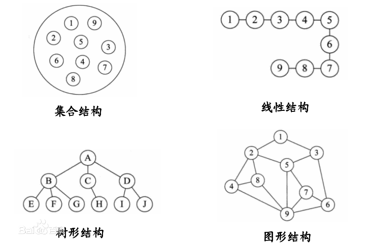

#### 什么是数据结构？

官方：数据结构是一门研究非数值计算的程序设计问题中的操作对象，以及它们之间的关系和操作等相关问题的学科。

个人理解：数据结构就是数据元素相互之间存在的一种或多种特定关系的集合

数据结构分为：

- 逻辑结构：指数据对象中数据元素之间的相互关系
- 物理结构：指数据的逻辑结构在计算机中的存储形式

四大逻辑结构：

- 集合结构：集合结构中的数据元素除了同属于一个集合外，它们之间没有其它的关系

- 线性结构：线性结构中的数据元素之间是一对一的关系

- 树形结构：树形结构中的数据元素之间存在一种一对多的层次关系
- 图形结构：图形结构的数据元素是多对多的关系

物理结构实际上研究的是如何把数据元素存储到计算机的存储器中。

存储器主要针对于内存而言，像硬盘，软盘等外部存储器的数据组织通常用文件结构来描述。

数据元素的存储结构形式有两种：

- 顺序存储结构：是把数据元素存放在地址连续的存储单元里，其数据间的逻辑关系和物理关系是一致的，例如编程语言的数组结构
- 链式存储结构：是把数据元素存放在任意的存储单元里，这组存储单元可以是连续的，也可以是不连续的。但这样不能反应其逻辑关系，所以使用了指针存放数据元素的地址，通过地址就可以找到相关联数据元素的位置。（每个元素都多费了一点空间，因为使用了指针）

